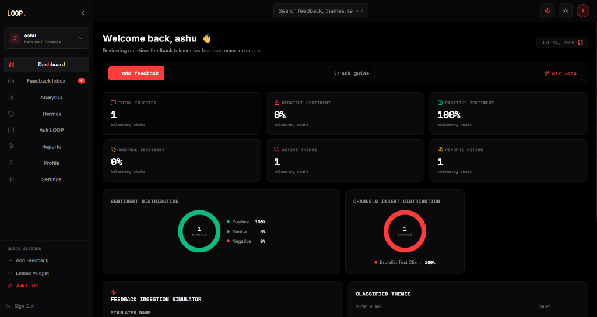
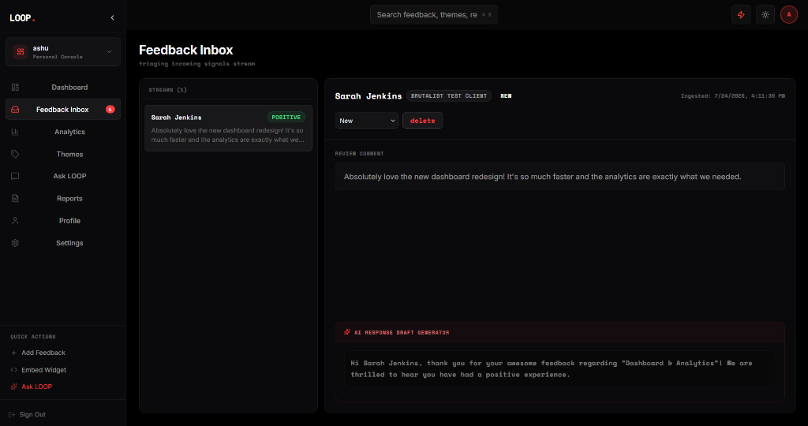
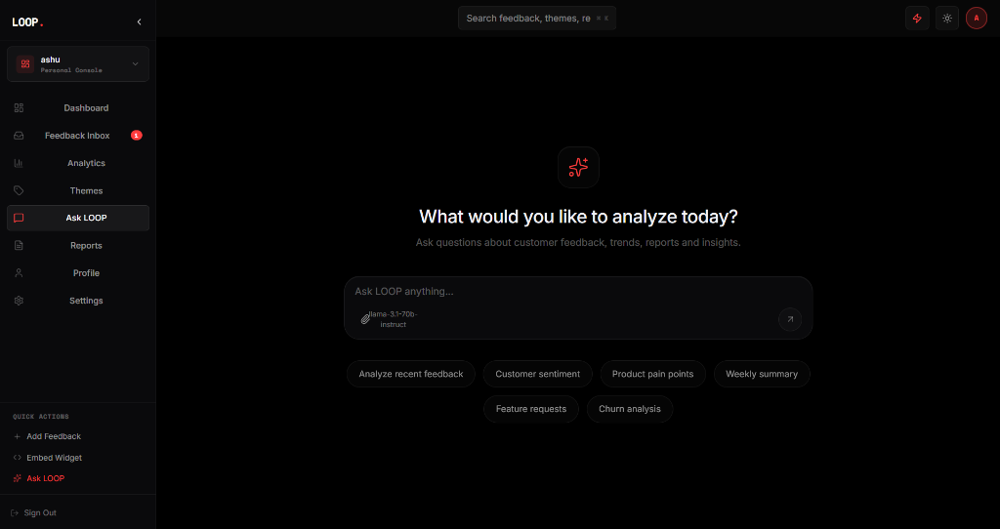
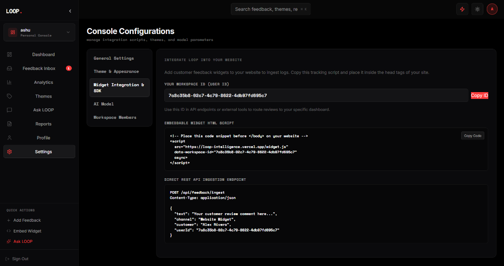

<div align="center">


**`artificial · human`**

*continuous intelligence for modern engineering teams.*

---


</div>

---

## `[overview]`

**loop.** is a premium customer feedback intelligence platform that bridges the gap between human intuition and artificial precision. It ingests product signals, processes them in real-time, scopes them to secure tenant workspaces, and surfaces executive-grade insights through a highly conversational, state-of-the-art AI interface — powered by DeepSeek-V4 on NVIDIA NIM and Supabase.

---

## `[key features & updates]`

The platform has been upgraded to a enterprise-grade SaaS architecture with the following implementation milestones:

| Component | Feature | Details |
|---|---|---|
| **AI Intelligence** | **Premium Chat Interface** | A completely redesigned "Ask LOOP" workspace matching Apple, Linear, and Vercel v0 aesthetics. Features landing state suggestions, smooth chat bubbles, and instant context streaming. |
| **Authentication** | **Multi-Tenant Workspaces** | Complete database migration implementing full workspace isolation. Sign-ups automatically trigger workspace creation (`on_auth_user_created`), making the creator the `ADMIN`. |
| **Security** | **Granular Role-Based Access (RBAC)** | Support for `ADMIN` (Full controls), `ANALYST` (Ingest & manage), and `VIEWER` (Read-only). Restrictions are enforced database-wide and validated at proxy API route layers. |
| **Database** | **Non-Recursive RLS Policies** | Security Definer helper functions (`get_user_workspaces`, `is_workspace_admin`) that eliminate PostgreSQL RLS policy loops and provide high-performance row queries. |
| **Integrations** | **Secure Ingestion Pipeline** | A robust `ingest_feedback` PostgreSQL RPC function enabling external widgets and test clients to write feedback anonymously to the database while enforcing strict tenancy rules. |
| **Showcase** | **60 FPS Cinematic Demo** | Standalone animated showcase page (`demo.html`) replicating dashboard charts, chat flows, and cursors. Includes a native `getDisplayMedia` 60 FPS recording tool. |

---

## `[interface preview]`

### 📊 Real-Time Tenancy Dashboard


### ✉️ Scoped Feedback Inbox


### 💬 Premium Ask LOOP AI Assistant


### ⚙️ Widget Integrations & Client SDK


---

## `[database schema & tenancy]`

The system enforces tenant isolation natively using PostgreSQL and Supabase Row Level Security (RLS). 

```
                               ┌───────────────────┐
                               │       auth.users  │
                               └─────────┬─────────┘
                                         │ (Trigger)
                               ┌─────────▼─────────┐
                               │     workspaces    │
                               └─────────┬─────────┘
                                         │ (1 : N)
                   ┌─────────────────────┼─────────────────────┐
                   │                     │                     │
         ┌─────────▼──────────┐ ┌────────▼─────────┐ ┌─────────▼──────────┐
         │ workspace_members  │ │     feedback     │ │       themes       │
         └────────────────────┘ └──────────────────┘ └────────────────────┘
         (Enforces ADMIN,       (scoped to         (counts & trends
          ANALYST, VIEWER)       workspace_id)      scoped to workspace)
```

### Table Definitions & Triggers:
1. **`workspaces`**: Represents isolated organizations.
2. **`workspace_members`**: Bridges `auth.users` to `workspaces` with custom enum roles (`ADMIN`, `ANALYST`, `VIEWER`).
3. **`on_auth_user_created` (Trigger)**: Automatically spawns a `"Personal Workspace"` and inserts the user as an `ADMIN` immediately upon email signup.
4. **`get_user_id_by_email` (RPC)**: Securely queries user UUIDs by email without exposing the auth schema, enabling secure dashboard invites.

---

## `[stack]`

```
frontend      react 19 + vite 8
backend       next.js 15 (app router api)
database      supabase postgres + pgsql triggers + security definer functions
ai engine     nvidia nim api (deepseek-ai/deepseek-v4-flash)
animations    framer motion + vanilla transitions
linting       oxlint
```

---

## `[quickstart]`

**prerequisites:** `node >= 18`, `npm >= 9`

```bash
# 1. Clone the repository
git clone https://github.com/noobcoder1982/LOOP.git
cd LOOP

# 2. Install dependencies
npm install

# 3. Configure environment
cp .env.example .env
# -> Populate Supabase credentials and NVIDIA NIM key (see environment)

# 4. Start local development server
npm run dev
```

---

## `[environment]`

Ensure the following variables are configured in `.env` for client-side and server-side components:

```env
# Supabase connection config
NEXT_PUBLIC_SUPABASE_URL=https://your-project.supabase.co
NEXT_PUBLIC_SUPABASE_ANON_KEY=your-anon-key

VITE_SUPABASE_URL=https://your-project.supabase.co
VITE_SUPABASE_ANON_KEY=your-anon-key

# AI Engine Key
VITE_NVIDIA_API_KEY=nvapi-xxxxxxxxxxxxxxxxxxxxxxxxxxxx
```

---

## `[api endpoints]`

All server-side endpoints forward client auth tokens (`Bearer <JWT>`) dynamically to verify caller identities against Supabase RLS:

- **`GET /api/feedback?userId=<id>`**: Fetch scoped workspace feedback.
- **`POST /api/feedback/ingest`**: Public/Private endpoint to process and ingest customer signals using secure database procedures.
- **`PUT /api/feedback`**: Modify feedback properties (requires `ADMIN` or `ANALYST`).
- **`DELETE /api/feedback`**: Remove a feedback record (requires `ADMIN` or `ANALYST`).
- **`GET /api/themes?userId=<id>`**: Fetch scoped workspace theme metrics.

---

## `[roles & permission matrix]`

| Feature | Admin | Analyst | Viewer | Guest / Widget |
|---|:---:|:---:|:---:|:---:|
| Read Workspace Data | ✅ | ✅ | ✅ | ❌ |
| Submit / Ingest Feedback | ✅ | ✅ | ❌ | ✅ *(via Secure Ingest RPC)* |
| Update Status / Assign | ✅ | ✅ | ❌ | ❌ |
| Delete Feedback | ✅ | ✅ | ❌ | ❌ |
| Invite Members & Update Roles | ✅ | ❌ | ❌ | ❌ |

---

## `[demo credentials checklist]`

To test and verify **Role-Based Access Control (RBAC)** policies without having to register new accounts, use these pre-seeded demo user credentials mapping to the same seed workspace:

| Role | Email Address | Password | Clearances |
|------|---------------|----------|------------|
| **ADMIN** | `admin@loop.intel` | `loop12345` | Manage teammates/roles, ingest, update status, delete |
| **ANALYST** | `analyst@loop.intel` | `loop12345` | Ingest feedback, update status, delete |
| **VIEWER** | `viewer@loop.intel` | `loop12345` | Read-only access to dashboard, inbox, ask loop |

*To seed these exact credentials in your database, execute the [demo_workspace_seed.sql](file:///c:/Users/DELL/Desktop/loop/demo_workspace_seed.sql) script in your Supabase SQL editor.*

---

## `[cinematic product demo]`

A pre-recorded or interactive cinematic showcase is available. It runs dynamically, simulating dashboard data loads, chat query typing, and report outputs:

1. Locate the [demo.html](file:///c:/Users/DELL/Desktop/loop/demo.html) file at the root.
2. Open it in a modern browser (Chrome / Edge recommended).
3. Click the **⏺ Record** button. It will ask to capture the tab stream.
4. Let the automation cycle run through its transitions (approx. 2.5 minutes).
5. Click **⏹ Stop** to trigger an automatic high-quality `.webm` video download.

---

## `[license]`

```
MIT License — © 2026 loop.intelligence
```

---

<div align="center">

*built at the intersection of human intuition and artificial precision.*

**`loop.`**

</div>
